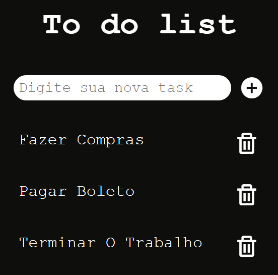

# To-Do List App

## Descrição

Este é um aplicativo simples de Lista de Tarefas desenvolvido em HTML, CSS e Javascript para ajudar na organização das suas tarefas diárias. Com este aplicativo, você pode adicionar, remover e marcar tarefas como concluídas.

## Website Link-

[https://lopesgeovane.github.io/ToDo/](https://lopesgeovane.github.io/ToDo/)

## Pré-requisitos

Por se tratar de um projeto simples, não se faz necessario requisistos, apenas ferramentas basicas das tecnologias CSS, HTML e Javascript.

## Instalação

Abra Git Bash.

Altere o diretório de trabalho atual para o local em que deseja ter o diretório clonado.

cole o codigo abaixo:

```bash
     
git clone https://lopesgeovane.github.io/ToDo/
    

```

## Screenshots



## Contribuindo

Sinta-se à vontade para contribuir com melhorias! Para contribuir com este projeto, siga os passos abaixo:

1. Faça um fork do repositório.
2. Clone o repositório forkado para o seu ambiente local.
3. Crie uma branch para suas alterações: `git checkout -b nome-da-sua-branch`.
4. Faça as modificações desejadas.
5. Commit suas alterações: `git commit -m "Descrição concisa das alterações"`.
6. Push para a sua branch: `git push origin nome-da-sua-branch`.
7. Abra um Pull Request no repositório original.

